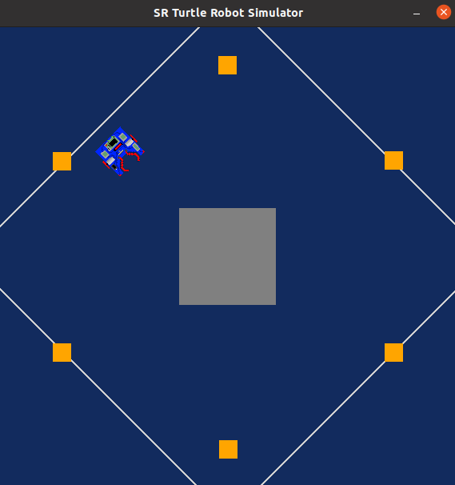
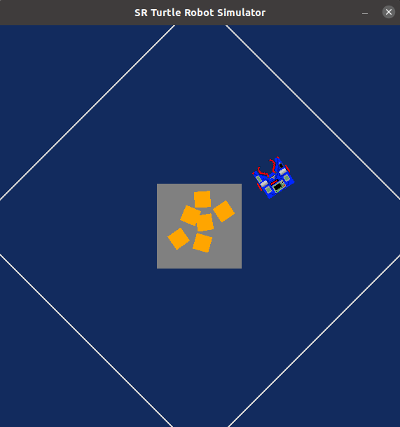

# Python Robot Simulator
Assignment for Research Track 1 Course.

## Simulator description
This is a simple, portable simulator developed by [Student Robotics](https://studentrobotics.org/).
The arena was modified to suit the particular objective of this exercise.

The simulator, in this particular arena, provides one **Holonomic robot** and 6 equidistant **golden tokens** which are placed around a central gray square, as it can be observed in the image below.



## Simulator Documentation
The API for controlling a simulated robot is designed to be as similar as possible to the [SR API][sr-api].

### Motors

The simulated robot has two motors configured for skid steering, connected to a two-output [Motor Board](https://studentrobotics.org/docs/kit/motor_board). The left motor is connected to output `0` and the right motor to output `1`.

The Motor Board API is identical to [that of the SR API](https://studentrobotics.org/docs/programming/sr/motors/), except that motor boards cannot be addressed by serial number. So, to turn on the spot at one quarter of full power, one might write the following:

```python
R.motors[0].m0.power = 25
R.motors[0].m1.power = -25
```

### The Grabber

The robot is equipped with a grabber, capable of picking up a token which is in front of the robot and within 0.4 metres of the robot's centre. To pick up a token, call the `R.grab` method:

```python
success = R.grab()
```

The `R.grab` function returns `True` if a token was successfully picked up, or `False` otherwise. If the robot is already holding a token, it will throw an `AlreadyHoldingSomethingException`.

To drop the token, call the `R.release` method.

Cable-tie flails are not implemented.

### Vision

To help the robot find tokens and navigate, each token has markers stuck to it, as does each wall. The `R.see` method returns a list of all the markers the robot can see, as `Marker` objects. The robot can only see markers which it is facing towards.

Each `Marker` object has the following attributes:

* `info`: a `MarkerInfo` object describing the marker itself. Has the following attributes:
  * `code`: the numeric code of the marker.
  * `marker_type`: the type of object the marker is attached to (either `MARKER_TOKEN_GOLD`, `MARKER_TOKEN_SILVER` or `MARKER_ARENA`).
  * `offset`: offset of the numeric code of the marker from the lowest numbered marker of its type. For example, token number 3 has the code 43, but offset 3.
  * `size`: the size that the marker would be in the real game, for compatibility with the SR API.
* `centre`: the location of the marker in polar coordinates, as a `PolarCoord` object. Has the following attributes:
  * `length`: the distance from the centre of the robot to the object (in metres).
  * `rot_y`: rotation about the Y axis in degrees.
* `dist`: an alias for `centre.length`
* `res`: the value of the `res` parameter of `R.see`, for compatibility with the SR API.
* `rot_y`: an alias for `centre.rot_y`
* `timestamp`: the time at which the marker was seen (when `R.see` was called).

For example, the following code lists all of the markers the robot can see:

```python
markers = R.see()
print "I can see", len(markers), "markers:"

for m in markers:
    if m.info.marker_type in (MARKER_TOKEN_GOLD, MARKER_TOKEN_SILVER):
        print " - Token {0} is {1} metres away".format( m.info.offset, m.dist )
    elif m.info.marker_type == MARKER_ARENA:
        print " - Arena marker {0} is {1} metres away".format( m.info.offset, m.dist )
```

[sr-api]: https://studentrobotics.org/docs/programming/sr/

# Installing and running 
The simulator was built and run with Ubuntu 22 and Python 3. Install them if it is not the case.
The simulator requires the [pygame](https://www.pygame.org/news) library, [PyPyBox2D](https://pypi.org/project/pypybox2d/2.1-r331/), and [PyYAML](https://pypi.org/project/PyYAML/). For installing them, run the following lines in the terminal.
```
$ sudo apt-get install python3-dev python3-pip python3-pygame python3-yaml
$ sudo pip3 install pypybox2d
$ cd /usr/local/lib/python3.8/dist-packages/pypybox2d
```
(check pypybox2d install directory since it might be different)

To download and run this simulator, install git and clone this repository. 
```
$ git clone https://github.com/AmiQuijano/Research_Track1.git
```

Once all the dependencies are installed, simply run the following line to test the simulator.
```
$ python3 run.py assignmentRobot.py
```

# Assignment
The project aims to make a holonomic robot move around the arena to find and grab all the golden tokens and collect them in a desired zone. For this assignment, the chosen dropp off zone was the central gray square of the arena. 

The result of the developed script is the following :D



## Code Description: Pseudocode
The code in the file `assignment.py` contains the following functions explained as pseudocode:

### drive(speed, seconds)
This function makes the robot move in a straight line forward or backwards (depending on `speed` sign) for a certain time given a desired speed. 

Arguments:
* `speed`: The velocity of the motors in this case equal on both motors in order to move straight.
* `seconds`:Time interval during which the robot will move straight.

```
Function drive(speed, seconds):
    Set power of Robot.motor.right to speed
    Set power of Robot.motor.left to speed
    Sleep for seconds
    Set power of Robot.motor.right to 0
    Set power of Robot.motor.left to 0
```
### turn(speed, seconds)
This function makes the robot turn either right or left (depending on `speed` sign) a certain time given a desired speed. 

Arguments:
* `speed`: The velocity of the motors in this case equal in magnitude on both motors but opposite in sign in order to make a turn.
* `seconds`:Time interval during which the robot will move straight.
  
```
Function turn(speed, seconds):
    Set power of Robot.motor.right to speed
    Set power of Robot.motor.left to -speed
    Sleep for seconds
    Set power of Robot.motor.right to 0
    Set power of Robot.motor.left to 0
```
### find_token(found_tokens)
This function finds the closest golden token identified by the robot with `R.see` within an initial maximum distance `dist` which have not yet been collected before. Keep in mind that `R.see` gives the distance `dist` and angle `rot_y` between the robot and the token seen. 

Arguments:
* `found_tokens`: List of token codes which have been collected

Returns:
* `dist`: distance of the closest token (-1 if no golden token is detected)
* `rot_y`: angle between the robot and the token (-1 if no golden token is detected)
* `num`: offset number ir ID of the token (-1 if no golden token is detected)

"""    
    FOR each token in R.see:
        If (token.dist < dist) and (token.type is MARKER_TOKEN_GOLD) and (token.ID not in found_tokens):
            Set dist to token.dist
            Set rot_y to token.rot_y
            Set num to token.ID
    END FOR
    
    IF dist is still 100:
        Return -1, -1, -1
    ELSE:
        Return dist, rot_y, num
```
### find_goal(goal_code)
This function finds the token assigned as the goal position (in this case, the center of the gray square in layout) identified by the robot with `R.see` within a maximum distance defined as `dist`. Keep in mind that `R.see` gives the distance `dist` and angle `rot_y` between the robot and the token seen. 

Arguments:
* `goal_code`: offset number of the token referenced as the goal

Returns:
* `dist`: distance to the token goal (-1 if no golden token is detected)
* `rot_y`: angle between the robot and the token goal (-1 if no golden token is detected)

```
Function find_goal(goal_code):
    FOR each goal in R.see():
        IF (goal.dist < dist) and (goal.ID is goal_code):
            Set dist to goal.dist
            Set rot_y to goal.rot_y
    END FOR
    
    IF dist is still 100:
        Return -1, -1
    ELSE:
        Return dist, rot_y
```

### move_token(found_tokens, goal_code, action, a_th, d_th_token, d_th_goal, grabbed_token)
```
Function move_token(found_tokens, goal_code, action, a_th, d_th_token, d_th_goal, grabbed_token):
    list_actions = []  # Sequence of velocities and times for both linear and rotational motion
    cond = True  # Condition to continue while loop

    while cond:
        If action == 1 or action == 2:
            d_th = d_th_token
            dist, rot_y, num = find_token(found_tokens)
        ElseIf action == 3:
            d_th = d_th_goal
            dist, rot_y = find_goal(goal_code)
            num = grabbed_token

        If num in found_tokens and num != goal_code:
            print('Token already collected. Searching...')
            turn(2, 0.5)
            list_actions.append({'action': 'turn', 'speed': 10, 'time': 0.5})
        ElIf dist == -1:
            print('No token in sight! Searching...')
            turn(2, 0.5)
            list_actions.append({'action': 'turn', 'speed': 10, 'time': 0.5})
        ElIf dist >= d_th:
            If -a_th <= rot_y <= a_th:
                print('Token detected! Approaching')
                drive(30, 0.5)
                list_actions.append({'action': 'drive', 'speed': 30, 'time': 0.5})
            ElIf rot_y > a_th:
                print('Token detected! Turning right a bit')
                turn(2, 0.5)
                list_actions.append({'action': 'turn', 'speed': 2, 'time': 0.5})
            ElIf rot_y < -a_th:
                print('Token detected! Turning left a bit')
                turn(-2, 0.5)
                list_actions.append({'action': 'turn', 'speed': -2, 'time': 0.5})
        ElIf dist < d_th:
            If action == 1:
                R.grab()
                print('Token {} grabbed'.format(num))
                print('Taking token to the collection area')
                For i in range(len(list_actions)):
                    move = list_actions[len(list_actions) - i - 1]
                    If move['action'] == 'drive':
                        drive(-move['speed'], move['time'])
                    Else:
                        turn(-move['speed'], move['time'])
                turn(-10, 1)
                R.release()
                drive(-10, 3)
                print('Token {} is the GOAL reference!'.format(num))
                cond = False
                Return num
            ElIf action == 2:
                R.grab()
                print('Token {} grabbed'.format(num))
                cond = False
                Return num
            ElIf action == 3:
                R.release()
                print('Token {} dropped at GOAL'.format(num))
                drive(-15, 3)
                turn(10, 3)
                cond = False
                Return num

```
### Main
```
# Constants
a_th = 2.0
d_th_token = 0.4
d_th_goal = 0.7

# Initializations
found_tokens = []
list_actions = []
goal_code = -1
action = 1
R = Robot()

    # Main function to move robot and tokens
    Function move_token(found_tokens, goal_code, action, a_th, d_th_token, d_th_goal, grabbed_token):

        list_actions = []  # Sequence of velocities and times for both linear and rotational motion
        cond = True  # Condition to continue while loop

        while cond:
            If action == 1 or action == 2:
                d_th = d_th_token
                dist, rot_y, num = find_token(found_tokens)
            ElseIf action == 3:
                d_th = d_th_goal
                dist, rot_y = find_goal(goal_code)
                num = grabbed_token

            If num in found_tokens and num != goal_code:
                print('Token already collected. Searching...')
                turn(2, 0.5)
                list_actions.append({'action': 'turn', 'speed': 10, 'time': 0.5})
            ElIf dist == -1:
                print('No token in sight! Searching...')
                turn(2, 0.5)
                list_actions.append({'action': 'turn', 'speed': 10, 'time': 0.5})
            ElIf dist >= d_th:
                If -a_th <= rot_y <= a_th:
                    print('Token detected! Approaching')
                    drive(30, 0.5)
                    list_actions.append({'action': 'drive', 'speed': 30, 'time': 0.5})
                ElIf rot_y > a_th:
                    print('Token detected! Turning right a bit')
                    turn(2, 0.5)
                    list_actions.append({'action': 'turn', 'speed': 2, 'time': 0.5})
                ElIf rot_y < -a_th:
                    print('Token detected! Turning left a bit')
                    turn(-2, 0.5)
                    list_actions.append({'action': 'turn', 'speed': -2, 'time': 0.5})
            ElIf dist < d_th:
                If action == 1:
                    R.grab()
                    print('Token {} grabbed'.format(num))
                    print('Taking token to the collection area')
                    For i in range(len(list_actions)):
                        move = list_actions[len(list_actions) - i - 1]
                        If move['action'] == 'drive':
                            drive(-move['speed'], move['time'])
                        Else:
                            turn(-move['speed'], move['time'])
                    turn(-10, 1)
                    R.release()
                    drive(-10, 3)
                    print('Token {} is the GOAL reference!'.format(num))
                    cond = False
                    Return num
                ElIf action == 2:
                    R.grab()
                    print('Token {} grabbed'.format(num))
                    cond = False
                    Return num
                ElIf action == 3:
                    R.release()
                    print('Token {} dropped at GOAL'.format(num))
                    drive(-15, 3)
                    turn(10, 3)
                    cond = False
                    Return num
```

## Main encountered difficulties


## Possible improvements
The code works very smoothly in the current arena layout. Theredfore, it would be worthit to test the code in other arena layouts where the golden tokens are placed differently or where there are also other types of tokens such as silver ones.
